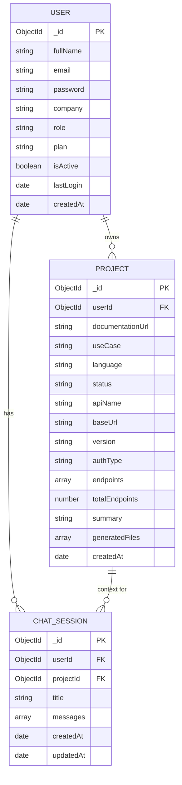
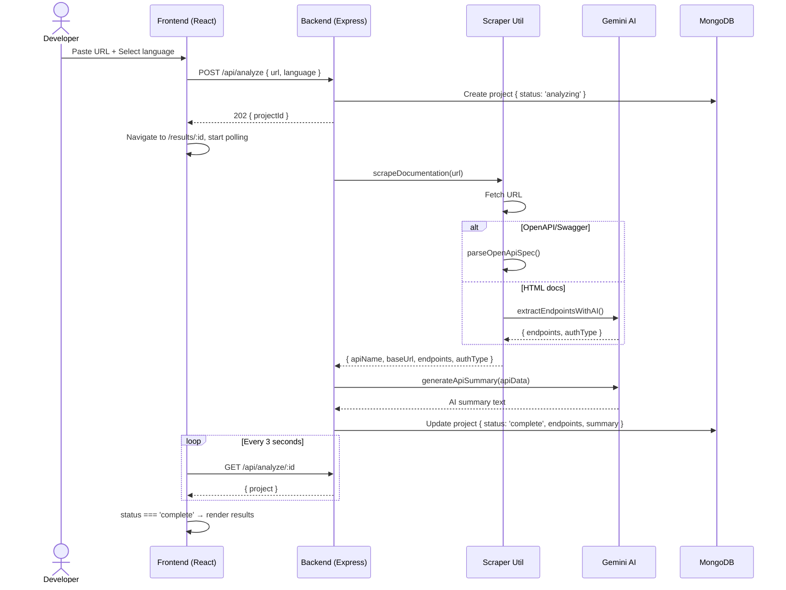
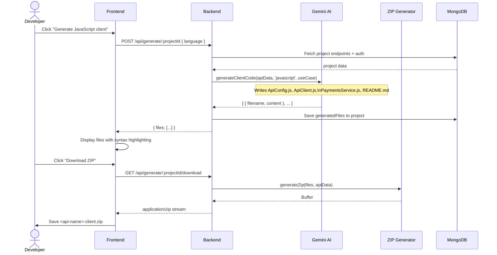
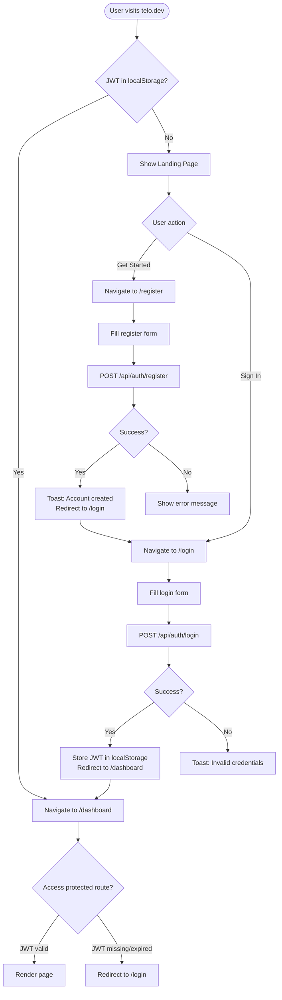
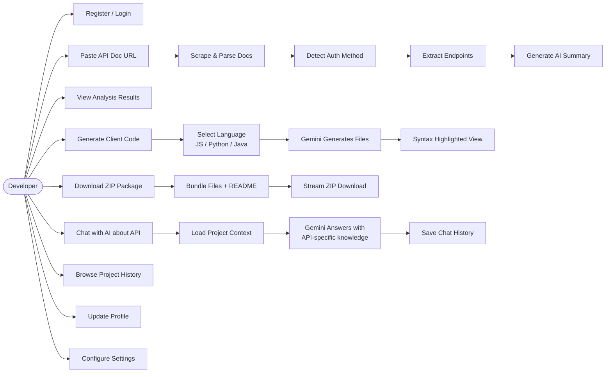

# TELO — System Diagrams

## 1. Architecture Diagram

```mermaid
graph TB
    subgraph Client["Client (Vercel CDN)"]
        LP[Landing Page]
        AUTH[Auth Pages\nLogin / Register]
        DASH[Dashboard]
        RES[Results Page]
        GEN[Generator Page]
        CHAT[AI Chat]
        HIST[History Page]
    end

    subgraph Backend["Backend (Render — Node.js / Express)"]
        AUTH_RT[/api/auth]
        ANA_RT[/api/analyze]
        GEN_RT[/api/generate]
        CHAT_RT[/api/chat]
        MW[JWT Middleware]
    end

    subgraph AI["External Services"]
        GEMINI[Google Gemini API]
        SWAGGER[API Docs URLs\nSwagger / OpenAPI / HTML]
    end

    subgraph DB["MongoDB Atlas"]
        USERS[(users)]
        PROJECTS[(projects)]
        CHATS[(chatSessions)]
    end

    LP --> AUTH
    AUTH -->|JWT token| DASH
    DASH --> ANA_RT
    RES --> GEN_RT
    CHAT --> CHAT_RT

    AUTH_RT --> MW
    ANA_RT --> MW
    GEN_RT --> MW
    CHAT_RT --> MW

    MW --> USERS
    ANA_RT -->|scrape| SWAGGER
    ANA_RT -->|AI summary| GEMINI
    GEN_RT -->|code gen| GEMINI
    CHAT_RT -->|AI reply| GEMINI

    ANA_RT --> PROJECTS
    GEN_RT --> PROJECTS
    CHAT_RT --> CHATS
```

---

## 2. Entity-Relationship Diagram



---

## 3. Analysis Sequence Diagram



---

## 4. Code Generation Sequence Diagram



---

## 5. Authentication Flow



---

## 6. Use Case Diagram


